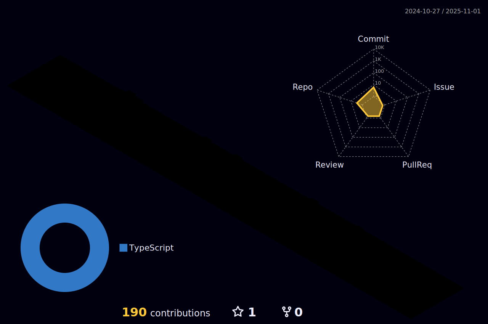

<h1 align="center">Welcome 💌, I'm <b>Muhammad Awais</b></h1>
<input></input>
 
 

 ## 🙋‍♂️ About Me
- 🎓 Founder and CEO of  <a href="empeer.tech" >EMPEER DEVLAB.</a>
- 🌱 I’m currently learning <b> Cloud Computing, Machine Learning, Blockchain development. </b>
- 👯 I’m looking to collaborate on **Innovative ideas and Open-Source Projects.**
- 🤔 I’m looking for help with **Machine Learning models, specifically NLP models and GANS**.
- 💬 Ask me for free **Code, Website,Mobile app Reviews**.
- 📫 Reach out to me @**awaixsawan@gmail.com** or <a href="https://www.linkedin.com/in/muhammad-awais--profile/" >LinkedIn id of Muhammad Awais</a>.
- 😄 Proverbs: _**Failure is Celeberation to enjoy your learning process.**_

<!--Social Media Links!-->

## Connect with me:

     

## 🚀 Technologies and Tools

 

 &emsp;
 &emsp;
 &emsp;
  &emsp;
    &emsp;
 &emsp;

 
  &emsp; 
   &emsp;
  &emsp; 
   &emsp;
   &emsp;
  &emsp;

 

 
   &emsp;
  &emsp;
   &emsp;
   &emsp;

 
 

## 📈Contribution Graph

<h2><i>⚙️ GitHub Analytics</i></h2>

  

## ⚡️Github Contributions
	
<h4 align="center">Isometric view of contributions in the last year</h4>

	

## 🐛Github Magic Game

  

 

